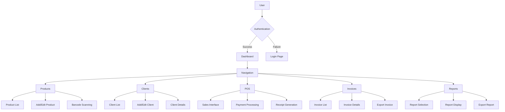
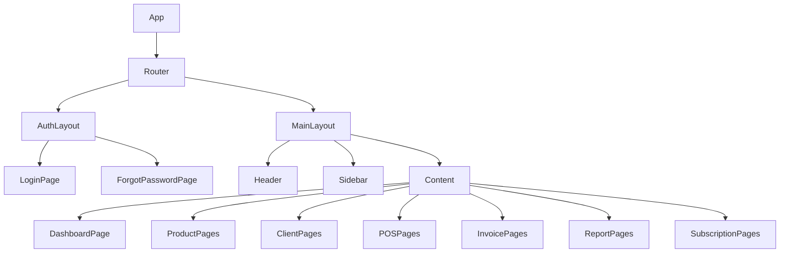
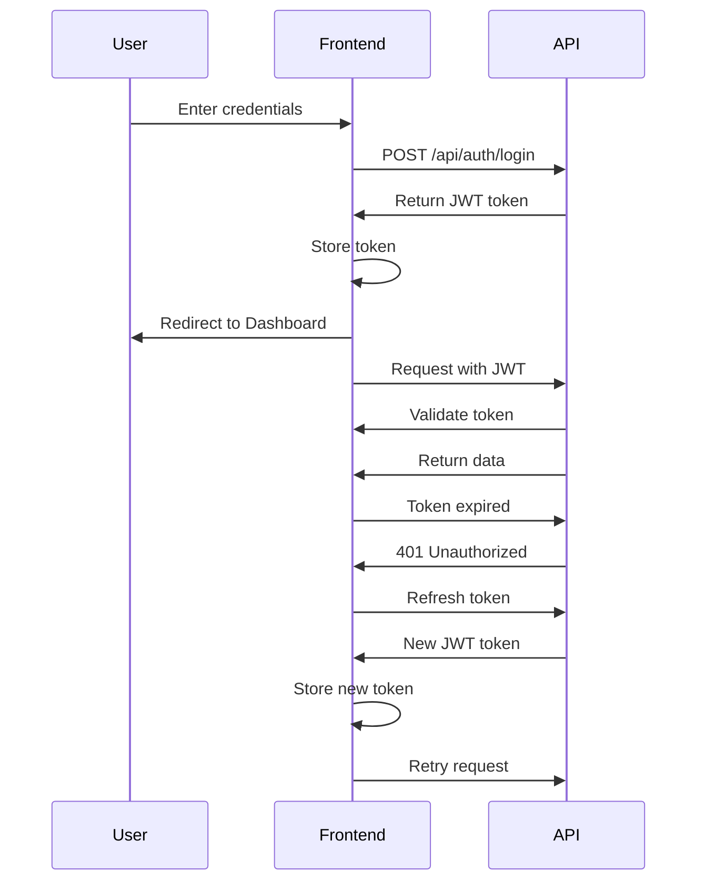

# Design Document

## Overview

This document outlines the design for the frontend implementation of the Stock Management Application. The frontend will be built using React.js with Tailwind CSS for styling, focusing on creating a responsive, intuitive, and efficient user interface for managing inventory, clients, sales, and invoicing.

## Architecture

The frontend application will follow a component-based architecture using React.js. The application will be structured as follows:

### Application Structure

```
frontend/
├── public/              # Static files
├── src/                 # Source code
│   ├── assets/          # Images, icons, and other static assets
│   ├── components/      # Reusable UI components
│   ├── contexts/        # React contexts for state management
│   ├── hooks/           # Custom React hooks
│   ├── layouts/         # Layout components
│   ├── pages/           # Page components
│   ├── services/        # API services
│   ├── utils/           # Utility functions
│   ├── App.jsx          # Main application component
│   ├── index.jsx        # Entry point
│   └── routes.jsx       # Application routes
├── .eslintrc.js         # ESLint configuration
├── package.json         # Dependencies and scripts
└── vite.config.js       # Vite configuration
```

### State Management

The application will use a combination of:
- React Context API for global state management (authentication, user preferences)
- React Query for server state management (data fetching, caching, and synchronization)
- Local component state for UI-specific state

## Components and Interfaces

### Core Components

1. **Authentication Components**
   - Login Form
   - Password Reset Form
   - Role-based access control wrapper

2. **Layout Components**
   - Main Layout (includes header, sidebar, and content area)
   - Dashboard Layout
   - Authentication Layout

3. **Navigation Components**
   - Sidebar (collapsible)
   - Header (with user profile, notifications, language selector)
   - Breadcrumbs

4. **Data Display Components**
   - Data Tables (sortable, filterable)
   - Cards
   - Charts (line, bar, pie)
   - Status indicators (for stock levels, expiration warnings)

5. **Form Components**
   - Input fields (text, number, date, select)
   - Form validation
   - Barcode scanner integration
   - File upload (for CSV imports)

6. **Feedback Components**
   - Notifications
   - Alerts
   - Modal dialogs
   - Loading indicators

### Page Components

1. **Authentication Pages**
   - Login
   - Forgot Password

2. **Dashboard Pages**
   - Main Dashboard (with key metrics and charts)
   - Role-specific dashboards

3. **Product Management Pages**
   - Product List
   - Product Form (Add/Edit)
   - Barcode Scanning Interface
   - Stock Adjustments

4. **Client Management Pages**
   - Client List
   - Client Form (Add/Edit)
   - Client Details (with credit history)

5. **POS (Point of Sale) Pages**
   - Sales Interface
   - Payment Processing
   - Receipt Generation

6. **Invoice Management Pages**
   - Invoice List
   - Invoice Details
   - Invoice Generation

7. **Subscription Management Pages (Super Admin)**
   - Business List
   - Subscription Plan Management
   - Business Access Control

8. **Reporting Pages**
   - Report Selection
   - Report Parameters
   - Report Display
   - Export Options

## Data Models

The frontend will work with the following data models, which will be used to type API responses and manage form data:

### User Model
```typescript
interface User {
  id: number;
  username: string;
  email: string;
  role: 'super_admin' | 'business_admin' | 'cashier' | 'inventory_manager';
  businessId?: number;
  name: string;
  language: 'en' | 'fr' | 'ar';
}
```

### Product Model
```typescript
interface Product {
  id: number;
  name: string;
  barcode: string;
  category: string;
  unitPrice: number;
  costPrice: number;
  supplier: string;
  description: string;
  expirationDate: string | null;
  quantity: number;
  minStockThreshold: number;
  businessId: number;
  createdAt: string;
  updatedAt: string;
}
```

### Client Model
```typescript
interface Client {
  id: number;
  name: string;
  phone: string;
  email: string;
  address: string;
  creditLimit: number;
  creditBalance: number;
  businessId: number;
  createdAt: string;
  updatedAt: string;
}
```

### Invoice Model
```typescript
interface Invoice {
  id: number;
  date: string;
  clientId: number | null;
  client?: Client;
  products: InvoiceProduct[];
  totalAmount: number;
  taxes: number;
  paymentMethod: 'cash' | 'credit' | 'mobile';
  paymentStatus: 'paid' | 'unpaid' | 'partial';
  businessId: number;
  createdAt: string;
  updatedAt: string;
}

interface InvoiceProduct {
  productId: number;
  name: string;
  quantity: number;
  unitPrice: number;
  subtotal: number;
}
```

### Subscription Model
```typescript
interface Subscription {
  id: number;
  businessId: number;
  planId: number;
  plan?: Plan;
  startDate: string;
  endDate: string;
  status: 'active' | 'expired' | 'pending';
  paymentId: number;
  createdAt: string;
  updatedAt: string;
}

interface Plan {
  id: number;
  name: string;
  price: number;
  duration: number; // in months
  maxUsers: number;
  maxProducts: number;
  features: string[];
  createdAt: string;
  updatedAt: string;
}
```

## API Integration

The frontend will communicate with the backend API using Axios. API services will be organized by domain:

```typescript
// Example API service for products
const ProductService = {
  getProducts: async (filters) => {
    const response = await axios.get('/api/products', { params: filters });
    return response.data;
  },
  
  getProduct: async (id) => {
    const response = await axios.get(`/api/products/${id}`);
    return response.data;
  },
  
  createProduct: async (product) => {
    const response = await axios.post('/api/products', product);
    return response.data;
  },
  
  updateProduct: async (id, product) => {
    const response = await axios.put(`/api/products/${id}`, product);
    return response.data;
  },
  
  deleteProduct: async (id) => {
    const response = await axios.delete(`/api/products/${id}`);
    return response.data;
  },
  
  scanBarcode: async (barcode) => {
    const response = await axios.get(`/api/products/barcode/${barcode}`);
    return response.data;
  }
};
```

## Error Handling

The application will implement a comprehensive error handling strategy:

1. **API Error Handling**
   - Centralized error interceptor for API requests
   - Specific error handling for different HTTP status codes
   - User-friendly error messages

2. **Form Validation**
   - Client-side validation before submission
   - Display of validation errors from the server
   - Field-level error messages

3. **Fallback UI**
   - Error boundaries for component errors
   - Fallback UI for failed data loading
   - Retry mechanisms for failed requests

## Authentication and Authorization

1. **Authentication**
   - JWT-based authentication
   - Token storage in secure HTTP-only cookies
   - Automatic token refresh
   - Session timeout handling

2. **Authorization**
   - Role-based access control
   - Protected routes
   - Conditional rendering of UI elements based on permissions

## Internationalization

The application will support multiple languages (English, French, and Arabic) using i18next:

1. **Language Selection**
   - Language selector in the header
   - Automatic language detection based on browser settings
   - Persistent language preference

2. **Translation Strategy**
   - Namespace-based translations
   - Dynamic loading of translation files
   - Support for RTL languages (Arabic)

## Responsive Design

The application will be fully responsive using Tailwind CSS:

1. **Breakpoints**
   - Mobile: < 640px
   - Tablet: 640px - 1024px
   - Desktop: > 1024px

2. **Layout Adjustments**
   - Collapsible sidebar on smaller screens
   - Stacked layouts on mobile
   - Responsive tables with horizontal scrolling on mobile

3. **Touch Optimization**
   - Larger touch targets on mobile
   - Swipe gestures where appropriate
   - Mobile-optimized forms

## Testing Strategy

1. **Unit Testing**
   - Test individual components in isolation
   - Mock API calls and context providers
   - Test form validation and error handling

2. **Integration Testing**
   - Test component interactions
   - Test form submissions and API integrations
   - Test authentication flows

3. **End-to-End Testing**
   - Test critical user flows (login, product management, sales)
   - Test across different browsers and devices

## Performance Optimization

1. **Code Splitting**
   - Route-based code splitting
   - Lazy loading of heavy components

2. **Caching**
   - API response caching with React Query
   - Local storage for user preferences

3. **Asset Optimization**
   - Image optimization
   - Font loading optimization
   - Bundle size monitoring

## Accessibility

1. **ARIA Attributes**
   - Proper labeling of form elements
   - Semantic HTML
   - Focus management

2. **Keyboard Navigation**
   - Fully navigable via keyboard
   - Logical tab order
   - Keyboard shortcuts for common actions

3. **Color Contrast**
   - Meet WCAG 2.1 AA standards
   - High contrast mode support

## Design System

The application will use a consistent design system based on Tailwind CSS:

1. **Colors**
   - Primary: Blue (#3B82F6)
   - Secondary: Gray (#6B7280)
   - Success: Green (#10B981)
   - Warning: Yellow (#F59E0B)
   - Danger: Red (#EF4444)
   - Background: White (#FFFFFF)
   - Text: Dark Gray (#1F2937)

2. **Typography**
   - Font Family: Inter
   - Headings: 24px, 20px, 18px, 16px
   - Body: 14px
   - Small: 12px

3. **Spacing**
   - Base unit: 4px
   - Scale: 4px, 8px, 12px, 16px, 24px, 32px, 48px, 64px

4. **Components**
   - Buttons (primary, secondary, outline, text)
   - Cards (default, interactive, status)
   - Forms (inputs, selects, checkboxes, radio buttons)
   - Tables (default, compact, expandable)
   - Modals (default, confirmation, form)

## Diagrams

### Application Flow



### Component Hierarchy



### Authentication Flow

